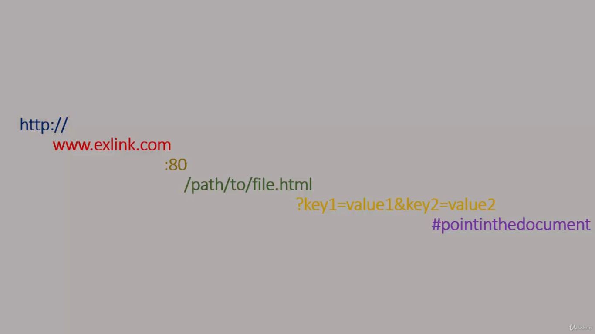

## The architecture
Throughout the entire course we will be consuming __resources__. Resources that are located somewhere, on a server. And our task is to retrieve the information provided for us within an API that we're going to use. In order to do it, you must be aware of the basic principles of communication between a *Client* and the *Server*.

<figure>
  
    
	<figcaption>
	  How Client-Server communication is processed.
	</figcaption>
  
</figure>

You can assume the *Client* as a simple web browser, and when you hit *Send* or *Enter* on a IP address or a URL within the search bar you are actually making an HTTP request which is sent to the *Server*. Then the *Server* on the other side starts checking for that resources and if they were found, then they are returned to the *Client* so the content of that resource can be visualized. 

This is know as the Response-Request model, a *Client* performs an HTTP request and the *Server* sends a HTTP response back. HTTO is the most common protocol that is used on such models. Now we gonna take a look at some predefined principles that circundes this model. 

There are four main verbs, or methods, in this system. __GET__, __POST__, __DELETE__ and __PUT__ .

* GET
The GET method requests a representation of the specified resource. Requests using GET should only retrieve data.

* POST
The POST method is used to submit an entity to the specified resource, often causing a change in state or side effects on the server.

* DELETE
The DELETE method deletes the specified resource.

* PUT
The PUT method replaces all current representations of the target resource with the request payload. Use with care.

<figure>
  
    
	<figcaption>
	  Visual representation of JSON forms structure.
	</figcaption>
  
</figure>

The image above represents what we need. We will be having some resources located on a server on [JSON](https://www.json.org/json-en.html) format, so we will be catching JSON and retrieving JSON only.

Before we get deeper into how JSON files look like let's cover another  fundamental topic: the URL. An acronym for Uniform Resource Locator which is consisted of different parts, highlighted on different colors in the image below.

<figure>
  
    
	<figcaption>
	  Components of an URL.
	</figcaption>
  
</figure>

* The Blue slice:
This is the protocol that the browser needs to use.

* The Red slice:
This is the domain name, saying which server we need to request.

* The Khaki slice:
This is the default port (80) and is usually omitted. If some different port is used so it must be informed.

* The Green slice:
This is the unique path to the resource we want to access.

* The Yellow slice:
These are the extra parameters, sent to the server.

* The purple slice:
This is the anchor; a particular point on the page the browser is redirected.

From now on keep on mind a few things, we will be working with APIs and will learn what is it in the next lessons, we will be working with resources located somewhere on a server, and we will use HTTP requests which comes from the HTTP protocol and we will be working with URLs.
