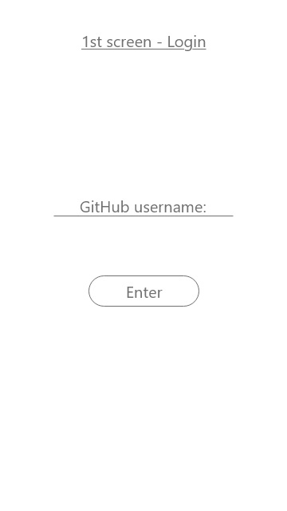
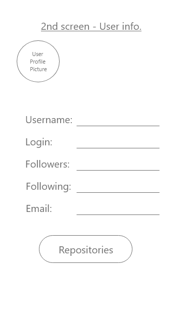
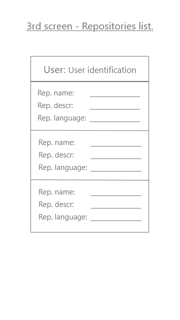
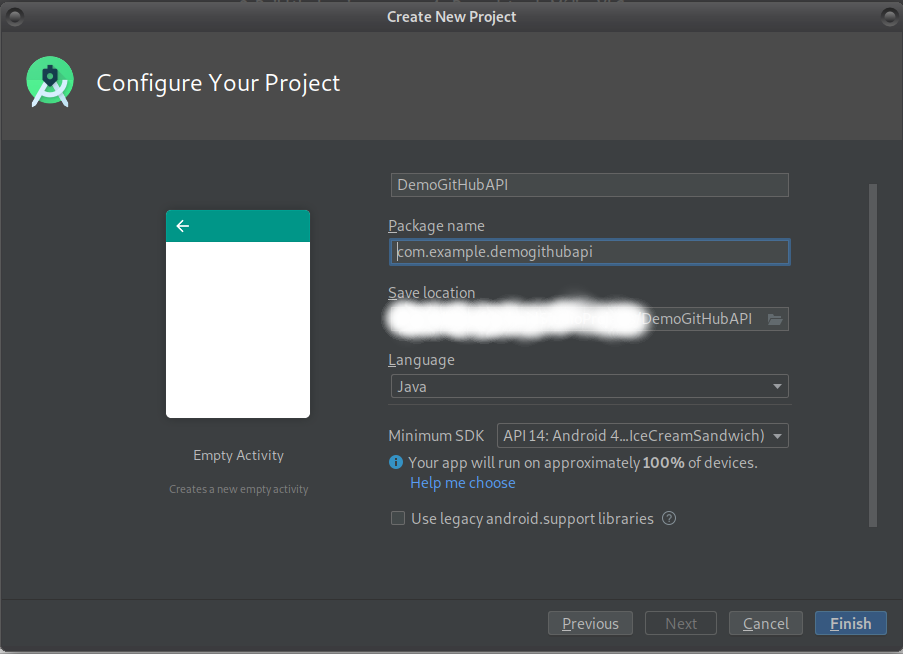

# First Hands-on (GitHub API)

Welcome back.

Having already passed through the basic concept and terminology, we are actually ready to get started with the apps building.

## Summary

* [Briefing](https://github.com/Bodera/learnPath_Android/blob/master/Retrofit_Course/03_1stHandsOn.md#briefing)
* [Android project setup](https://github.com/Bodera/learnPath_Android/blob/master/Retrofit_Course/03_1stHandsOn.md#project-setup)
* [Building login screen](https://github.com/Bodera/learnPath_Android/blob/master/Retrofit_Course/03_1stHandsOn.md#building-login-screen)
* [Building user screen](https://github.com/Bodera/learnPath_Android/blob/master/Retrofit_Course/03_1stHandsOn.md#building-login-screen)
* [Building REST logic](https://github.com/Bodera/learnPath_Android/blob/master/Retrofit_Course/03_1stHandsOn.md#building-rest-logic)

### Briefing

The first application we are going to build is to use the [GitHub API](https://api.github.com/).

So there are some basic steps you need to always take when you start working with an API. Two important things, firts is to find the documentation (and depending on the frequency of usage of the API the documentation is going to be well developed). Here is the [GitHub API documentation](https://developer.github.com/v3/) for version 3.

So it's up to you to pass through the main things to have a basically idea, there are given a lot of examples that you will start understanding once the course is over. So this is the first milestone you need to be aware of.

The second one is the `route` or the main endpoint that you need. The API is alocated on a specific address and from there on are given different endpoints for different resources.

When you start building an application based on an API it's important to be aware of the kind of information you need. Then to find the endpoint required and from there on you start building it.

Some commong features: when you see something, over the parameters, with curly brackets it means that this is a substitution.

```javascript
https://github.com/settings/connections/applications{/client_id}
```

Even programmatically and dynamically, you need to give them different resources, remember that ok.

The API structure is represented as a JSON (key and value pairs), and the separation is done with a comma.

```javascript
This is how an endpoint looks like
{
  current_user_url	"https://api.github.com/user"
}
```

Good, now what we want to do? It's just an advice, draw some mockups. After you having a good idea about what you want to show on screen you can start searching for approaches and for different methods in wish it can be done.

You can register yourself with your username on the first screen. Keep in mind that in order to this work you need to have a GitHub profile. If you don't have any at all you have two options: first one is to go on to register [at here](https://github.com/join?source=header-home), the second option is to use somebody else credentials. You are strongly advised to create a profile even for just see how the whole process is going to be structured.

There are three screens:



On the first screen, we want to enter our username, just the username without the password for the sake of simplicity. And then we have a `login` button, once the login button is pressed the app advances to the second screen.



The image above is from the second screen, the user's screen. Here will be the information we want to retrieve from the API, we can see that we will have the picture of the user registered in GitHub, the username, login name, the number of followers, the number of people that the user is following and the user e-mail. That's the main structure of the user's screen. Here we also have a `repositories` button, and what we want is that when this button is pressed the app loads the third screen.



The image above is from the third screen, here we're having below the username a list containing information about the user repositories. Here we have the repository name, the description of the repository, and the language the repository is written in. And that is it.

Try to check out the endpoints by substituting the values on the resources.

### Project setup

1. Open Android Studio and select *Start a new Android Studio project* option.
2. As a template, choose the *Empty Activity* and click on the *Next* button.
3. Above an illustration of how fill the fields in the configurations form. Click on *Finish* button and you're ready to move to next step.


### Building Log-in screen

1. After the gradle has successfully be built, using the *Refactor* feature ➜ *Rename file...* ➜ rename `MainActivity.java` to `LoginActivity.java`.
2. Check the if the *class name*, *android manifest*, and *resource layout* have been changed properly.
3. The code for `activity_log_in.xml`:

```xml
<?xml version="1.0" encoding="utf-8"?>
<RelativeLayout
  xmlns:android="http://schemas.android.com/apk/res/android"
  xmlns:tools="http://schemas.android.com/tools"
  android:layout_width="match_parent"
  android:layout_height="match_parent"
  android:paddingBottom="@dimen/activity_vertical_margin"
  android:paddingLeft="@dimen/activity_horizontal_margin"
  android:paddingRight="@dimen/activity_horizontal_margin"
  android:paddingTop="@dimen/activity_vertical_margin"
  tools:context="com.example.demogithubapi.LoginActivity">

  <EditText
    android:id="@+id/input_username"
    android:layout_width="match_parent"
    android:layout_height="wrap_content"
    android:inputType="text"
    android:hint="@string/username"/>

  <Button
    android:id="@+id/btn_login"
    android:layout_width="fill_parent"
    android:layout_height="wrap_content"
    android:layout_marginTop="20dp"
    android:layout_marginBottom="20dp"
    android:padding="15dp"
    android:layout_below="@id/input_username"
    android:text="@string/login"
    android:onClick="getUser"/>
</RelativeLayout>
```

* Notice that you will also have to add an `dimens.xml` resource file under `res` ➜ `values` tree.

Code for *dimens.xml*:

```xml
<?xml version="1.0" encoding="utf-8"?>
<resources>
    <!-- Default screen margins, per the Android Design guidelines. -->
    <dimen name="activity_horizontal_margin">16dp</dimen>
    <dimen name="activity_vertical_margin">16dp</dimen>
</resources>
```

Code for *strings.xml*:

```xml
<resources>
    <string name="app_name">DemoGitHubAPI</string>

    <string name="username">Username: </string>
    <string name="login">Login</string>
    <string name="repositories">Repositories</string>
</resources>

```

Code for *colors.xml*:

```xml
<?xml version="1.0" encoding="utf-8"?>
<resources>
    <color name="colorPrimary">#3F51B5</color>
    <color name="colorPrimaryDark">#303F9F</color>
    <color name="colorAccent">#FF4081</color>

    <!--https://material.google.com/style/color.html#color-color-palette -->
    <color name="gray_300">#E0E0E0</color>
    <color name="black_70">#b2000000</color>
    <color name="gray_500">#9E9E9E</color>

    <color name="green">#009933</color>
    <color name="dark_red">#992600</color>
    <color name="dark_blue">#003366</color>
</resources>
```

Now we are going to add the functionalities in the `LoginActivity.java`:

```java
package com.example.demogithubapi.activity;

import androidx.appcompat.app.AppCompatActivity;

import android.content.Intent;
import android.os.Bundle;
import android.view.View;
import android.widget.Button;
import android.widget.EditText;

import com.example.demogithubapi.R;

public class LoginActivity extends AppCompatActivity {

    private Button login;
    private EditText inputUsername;

    private Intent intent;

    @Override
    protected void onCreate(Bundle savedInstanceState) {
        super.onCreate(savedInstanceState);
        setContentView(R.layout.activity_log_in);

        login = (Button) findViewById(R.id.btn_login);
        inputUsername = (EditText) findViewById(R.id.input_username);
    }

    public void getUser(View view) {

        intent = new Intent(LoginActivity.this, UserActivity.class);
        intent.putExtra("STRING_THAT_I_NEED", inputUsername.getText().toString());
        startActivity(intent);
    }
}
```

### Building the user screen

It's time to inject the necessary dependencies to our project, the [Retrofit library](https://github.com/square/retrofit) and the [Gson library](https://github.com/google/gson). Retrofit is an HTTP client and the Gson is useful to convert Java objects to the JSON representation.

Open the `build.gradle` (*Module:app*) file. Should look like this:

```java
apply plugin: 'com.android.application'

android {
    compileSdkVersion 29
    buildToolsVersion "29.0.3"

    defaultConfig {
        applicationId "com.example.demogithubapi"
        minSdkVersion 14
        targetSdkVersion 29
        versionCode 1
        versionName "1.0"

        testInstrumentationRunner "androidx.test.runner.AndroidJUnitRunner"

        //Java 8 issue -> https://github.com/andriydruk/RxDNSSD/issues/43
        compileOptions {
            sourceCompatibility JavaVersion.VERSION_1_8
            targetCompatibility JavaVersion.VERSION_1_8
        }
    }

    buildTypes {
        release {
            minifyEnabled false
            proguardFiles getDefaultProguardFile('proguard-android-optimize.txt'), 'proguard-rules.pro'
        }
    }

}

dependencies {
    implementation fileTree(dir: 'libs', include: ['*.jar'])

    implementation 'androidx.appcompat:appcompat:1.0.2'
    implementation 'androidx.constraintlayout:constraintlayout:1.1.3'
    testImplementation 'junit:junit:4.12'
    androidTestImplementation 'androidx.test.ext:junit:1.1.1'
    androidTestImplementation 'androidx.test.espresso:espresso-core:3.2.0'
}
```

Add the remote binaries that refer to the libraries into the `dependencies` block.

```java
dependencies {
    implementation fileTree(dir: 'libs', include: ['*.jar'])

    implementation 'androidx.appcompat:appcompat:1.0.2'
    implementation 'androidx.constraintlayout:constraintlayout:1.1.3'
    testImplementation 'junit:junit:4.12'
    androidTestImplementation 'androidx.test.ext:junit:1.1.1'
    androidTestImplementation 'androidx.test.espresso:espresso-core:3.2.0'

    // Gson and Retrofit
    implementation 'com.google.code.gson:gson:2.8.6'
    implementation 'com.squareup.retrofit2:retrofit:2.8.1'
}
```

Also update your `AndroidManifest.xml` and add the INTERNET permission below the *package="package_name"* line.

```xml
<?xml version="1.0" encoding="utf-8"?>
<manifest xmlns:android="http://schemas.android.com/apk/res/android"
    package="com.example.demogithubapi">

    <uses-permission android:name="android.permission.INTERNET"/>

    <application
      ...>
    </application>

</manifest>
```

Time to create the `activity_user.xml` layout file. The code is below:

```xml
<?xml version="1.0" encoding="utf-8"?>
<LinearLayout
  xmlns:android="http://schemas.android.com/apk/res/android"
  android:background="@color/gray_300"
  android:layout_height="match_parent"
  android:layout_width="match_parent"
  android:padding="@dimen/activity_vertical_margin"
  android:orientation="vertical">

  <ImageView
    android:id="@+id/avatar"
    android:layout_width="wrap_content"
    android:layout_height="wrap_content"
    style="@android:style/TextAppearance" />

  <TextView
    android:id="@+id/username"
    android:layout_marginTop="15dp"
    android:layout_width="wrap_content"
    android:layout_height="wrap_content"
    style="@android:style/TextAppearance" />

  <TextView
    android:id="@+id/login"
    android:layout_width="wrap_content"
    android:layout_height="wrap_content"
    style="@android:style/TextAppearance" />

  <TextView
    android:id="@+id/followers"
    android:layout_width="wrap_content"
    android:layout_height="wrap_content"
    style="@android:style/TextAppearance" />

  <TextView
    android:id="@+id/following"
    android:layout_width="wrap_content"
    android:layout_height="wrap_content"
    style="@android:style/TextAppearance" />

  <TextView
    android:id="@+id/email"
    android:layout_width="wrap_content"
    android:layout_height="wrap_content"
    style="@android:style/TextAppearance" />

  <Button
    android:id="@+id/ownedReposBtn"
    android:layout_gravity="center"
    android:layout_marginTop="15dp"
    android:text="@string/repositories"
    android:textSize="16sp"
    android:textAllCaps="false"
    android:onClick="loadOwnRepos"
    android:layout_width="wrap_content"
    android:layout_height="wrap_content" />

</LinearLayout>
```

In order to make the code above work, you need to modify the `styles.xml` resource file under `res` ➜ `values` tree.

```xml
<resources>

    <!-- Base application theme. -->
    <style name="AppTheme" parent="Theme.AppCompat.Light.DarkActionBar">
        <!-- Customize your theme here. -->
        <item name="colorPrimary">@color/colorPrimary</item>
        <item name="colorPrimaryDark">@color/colorPrimaryDark</item>
        <item name="colorAccent">@color/colorAccent</item>
    </style>

    <style name="TextAppearance">
        <item name="android:textColor">@color/black_70</item>
        <item name="android:textSize">14sp</item>
        <item name="android:padding">5dp</item>
        <item name="android:layout_width">wrap_content</item>
        <item name="android:layout_height">wrap_content</item>
    </style>

</resources>
```

Now we are going to add functionalities to the `UserActivity.java` file.

```java
package com.example.demogithubapi.activity;

import android.content.Intent;
import android.os.Bundle;
import android.view.View;
import android.widget.Button;
import android.widget.ImageView;
import android.widget.TextView;

import androidx.appcompat.app.AppCompatActivity;

import com.example.demogithubapi.R;

public class UserActivity extends AppCompatActivity {

    ImageView avatarImg;
    TextView usernameTV;
    TextView followersTV;
    TextView followingTV;
    TextView loginTV;
    TextView emailTV;
    Button ownedReposBtn;

    Bundle extras;
    String newString;

    @Override
    protected void onCreate(Bundle savedInstanceState) {
        super.onCreate(savedInstanceState);
        setContentView(R.layout.activity_user);

        avatarImg = (ImageView) findViewById(R.id.avatar);
        usernameTV = (TextView) findViewById(R.id.username);
        followersTV = (TextView) findViewById(R.id.followers);
        followingTV = (TextView) findViewById(R.id.following);
        loginTV = (TextView) findViewById(R.id.login);
        emailTV = (TextView) findViewById(R.id.email);
        ownedReposBtn = (Button) findViewById(R.id.ownedReposBtn);

        extras = getIntent().getExtras();
        assert extras != null; //avoiding exception
        newString = extras.getString("STRING_THAT_I_NEED");

        System.out.println(newString); //debug
    }

    public void loadOwnRepos(View view){

        Intent intent = new Intent(UserActivity.this, Repositories.class);
        intent.putExtra("username", newString);
        startActivity(intent);
    }
}
```

### Building REST logic
