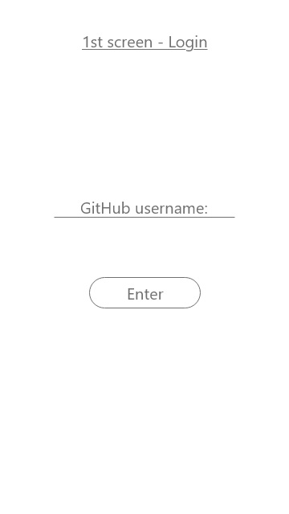
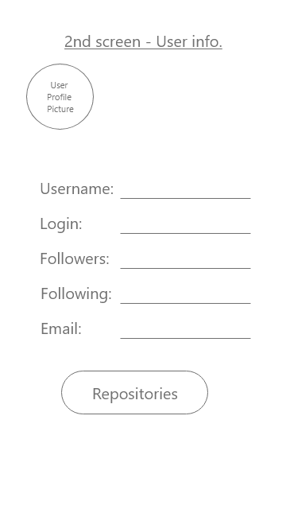
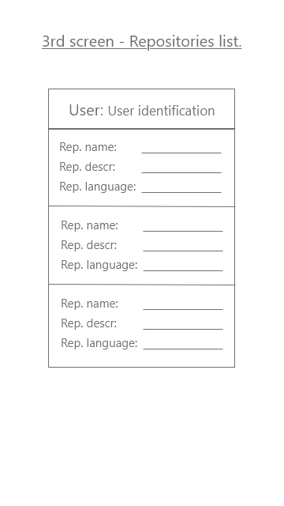

## 1st Hands-on 
Welcome back.

Having already passed through the basic concept and terminology, we are actually ready to get started with the apps building.

The first application we are going to build is to use the [GitHub API](https://api.github.com/).

So there are some basic steps you need to always take when you start working with an API. Two important things, firts is to find the documentation (and depending on the frequency of usage of the API the documentation is going to be well developed). Here is the [GitHub API documentation](https://developer.github.com/v3/) for version 3. 

So it's up to you to pass through the main things to have a basically idea, there are given a lot of examples that you will start understanding once the course is over. So this is the first milestone you need to be aware of.

The second one is the `route` or the main endpoint that you need. The API is alocated on a specific address and from there on are given different endpoints for different resources.

When you start building an application based on an API it's important to be aware of the kind of information you need. Then to find the endpoint required and from there on you start building it.

Some commong features: when you see something, over the parameters, with curly brackets it means that this is a substitution.

```html5
https://github.com/settings/connections/applications{/client_id}
```

Even programmatically and dynamically, you need to give them different resources, remember that ok.

The API structure is represented as a JSON (key and value pairs), and the separation is done with a comma. 

```html5
This is how an endpoint looks like
{
  current_user_url	"https://api.github.com/user"
}
```

Good, now what we want to do? It's just an advice, draw some mockups. After you having a good idea about what you want to show on screen you can start searching for approaches and for different methods in wish it can be done.

You can register yourself with your username on the first screen. Keep in mind that in order to this work you need to have a GitHub profile. If you don't have any at all you have two options: first one is to go on to register [at here](https://github.com/join?source=header-home), the second option is to use somebody else credentials. You are strongly advised to create a profile even for just see how the whole process is going to be structured.

There are three screens:

<figure>
  	
  <figcaption style="text-align:center;">1st Screen.</figcaption>
</figure>

On the first screen, we want to enter our username, just the username without the password for the sake of simplicity. And then we have a `login` button, once the login button is pressed the app advances to the second screen.

<figure>
  	
  <figcaption style="text-align:center;">2nd Screen.</figcaption>
</figure>

The image above is from the second screen, the user's screen. Here will be the information we want to retrieve from the API, we can see that we will have the picture of the user registered in GitHub, the username, login name, the number of followers, the number of people that the user is following and the user e-mail. That's the main structure of the user's screen. Here we also have a `repositories` button, and what we want is that when this button is pressed the app loads the third screen.

<figure>
  	
  <figcaption style="text-align:center;">3rd Screen.</figcaption>
</figure>

The image above is from the third screen, here we're having below the username a list containing information about the user repositories. Here we have the repository name, the description of the repository, and the language the repository is written in. And that is it.

Try to check out the endpoints by substituting the values on the resources. See you in the next lesson.
